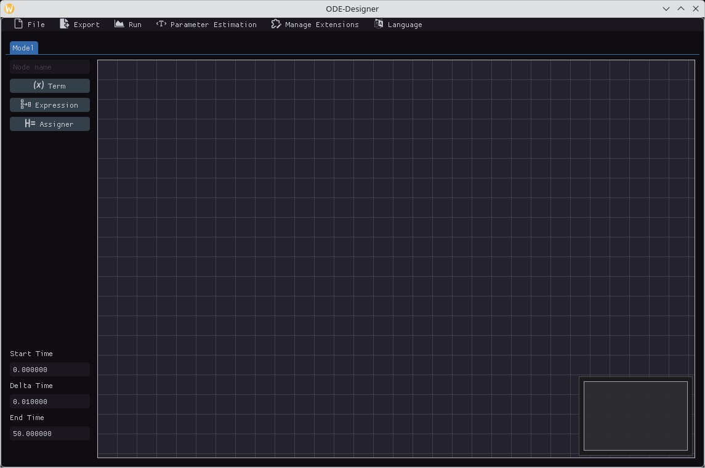
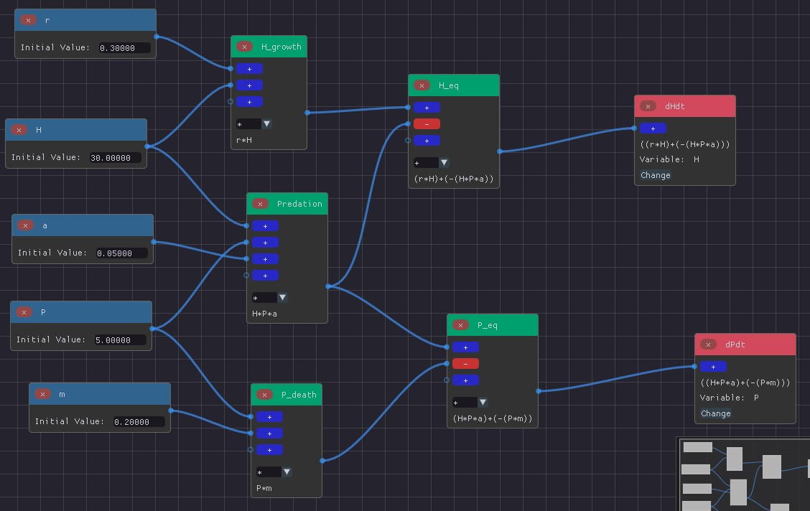

# ODE-Designer

## Introduction

Below are the description of the software, how to install it, and a brief introduction on how to use it.

## About the software

The names of the software developers are in the CONTRIBUTORS file.

ODE-Designer was developed in the context of a FAPEMIG research project by postgraduate students and undergraduate students in Computer Science at the Federal University of São João Del-Rei ([UFSJ](https: //ufsj.edu.br)).

The main objective of ODE-Designer is to facilitate the creation, implementation and simulation of Ordinary Differential Equation (ODE) models. The software can be applied to research and teaching-learning of Computational Modeling.

Through a visually intuitive graphical user interface (GUI), ODE-Designer allows users to conceptualize and ``draw'' mathematical models, while the software automatically generates the requisite implementation, simulation, and result visualization code. A distinguished feature of the software is the model's visual representation. It is designed to be intuitive and easy to use.

## Description of the software

Model construction in ODE-Designer involves creating nodes and establishing connections between them. These connections are made through pins, which come in two types: (a) input pins and (b) output pins. Input pins receive values from other nodes, while output pins transmit values. Connections are always unidirectional, linking an output pin from a source node to an input pin on a destination node.

Expressions are constructed by combining terms and other expressions within the software. An Assigner node holds a single expression, representing the right-hand side of an ODE. The name Assigner denotes a node that receives an expression and assigns it to a target variable. The input expression is a right-hand side of an ODE. 

Once a model is constructed, users can interact with the software in multiple ways: they can execute simulations directly within the GUI, generate PDF reports containing the simulation results, or export the corresponding Python code representation. Both GUI-based simulations and those executed via exported Python code leverage the solve\_ivp method from the scientific computing library Scipy.

### Model building and simulation workflow on ODE-Designer

Upon launching ODE-Designer, the initial interface presents an empty node editor along with a side menu for creating different node types as shown in the figure below. Nodes can be added to the editor either via this menu or through the context menu accessed by right-clicking.



Model building in ODE-Designer follows a structured workflow:

<ul>
  <li><strong>Creating Term Nodes:</strong> The first step involves defining term nodes for each variable, parameter, and constant in the model.</li>
  <li><strong>Constructing Expression Nodes:</strong> Expression nodes define mathematical operations and interaction terms. These nodes progressively build up the full right-hand side expressions for each ODE. </li>
  <li><strong>Assigning ODEs to Variables:</strong> Finally, assigner nodes associate each constructed expression with its corresponding variable, completing the model definition.</li>
</ul> 

The Predator-Prey model built on ODE-Designer is presented in the figure below. 



Once the model is constructed, users specify simulation parameters, including initial time, time step (temporal discretization), and simulation duration, via the sidebar. Optional settings allow users to label the x and y axes for visualization.

When executed, ODE-Designer automatically generates Python code, leveraging the SciPy library to numerically solve the system. Simulation results are stored in a CSV file and visualized within the GUI using the [ImPlot library](https://github.com/epezent/implot).  

Upon simulation completion, ODE-Designer opens new tabs to display the results. The first tab presents a combined population plot, while subsequent tabs provide individual population dynamics. The tab-based interface enables seamless switching between model construction, simulation results, and additional functionalities such as parameter estimation. 

### Node-based editor


### Plotting


### Python code export and pdf export

```py
# imports of scipy and numpy omitted

def initial_values() -> np.ndarray:
    Var_0 = 1.0
    return np.array((Var_0,))


def constants() -> list:
    Const = 2.0
    return [Const]


def variable_names() -> list[str]:
    return ["Var"]


def system(t: np.float64, y: np.ndarray, *constants) -> np.ndarray:
    Var, = y
    Const, = constants

    dVar_dt = Var*Const

    return np.array([dVar_dt])

# Rest of the code used to simulate and plot to PDF omitted
```

### Extensibility via Python code

Given the following Python code:

```py
import math

@node
def sine(x):
    return math.sin(x)


@node(format="$1 ^ $2")
def power(x, y):
    return x ** y
```

By importing it in the *Manage Extensions* menu, you can use the defined nodes as if they were native, as in the image below.


The code can be used to simulate just like native nodes.


## How to install

It is recommended to use the executables available in *Releases* on GitHub. [This link](https://github.com/ufsj-dcomp/ode-designer-rs/releases/latest) can be used to always redirect to the latest version.

### Linux

The Linux distribution uses [AppImages](https://appimage.org/), which requires a runtime (`fuse2`) installable on all Linux-based distributions. It is commonly included by default by some distributions, or is already installed by another program.

> [!NOTE]
> Although AppImages can make binaries super portable in Linux, there's still a
> hard dependency on your system's GLIBC, which cannot be redistributed. As it
> stands, the **minimum supported version is 2.28**. You can check your system's
> version with this command:
> ```sh
> ldd --version
> ```
>
> If your system meets this requirement, but you still get errors related to
> GLIBC, please open an issue and we'll look into it.

<details>
<summary><b>🐧 For Debian/Ubuntu/Pop_OS!/ElementaryOS</b></summary>

```sh
$ sudo apt install libfuse2
```

</details>

<details>
<summary><b>🐧 For ArchLinux</b></summary>

```sh
$ sudo pacman -S fuse2
```

</details>

### Windows

The Windows distribution consists of a ZIP that can be extracted and its contents executed.

## Compilation

### Using Docker

You can use the provided Dockerfile to build your own AppImage with no build tools installed directly on your system. Simply run:

```sh
$ docker build -t ode-designer-appimage-builder --output=. .
```

After this execution, the AppImage should be available in `./ode-designer.AppImage`. This AppImage, as well as those found in *Releases*, include Python and the `scipy` and `matplotlib` dependencies for code generation, interactive simulation and PDF export.

### Manually

To compile and run the software outside of the AppImage, the Rust toolchain (nightly version) is required, as well as Python >= 3.11, and the dependencies listed in `requirements.txt`. Fulfilling these requirements, simply compile like any Rust project, running

```sh
$ cargo run
```

Or

```sh
$ cargo build --release
$ ./target/release/ode-designer-rs
```

If anything goes wrong, try

```sh
$ git submodule update --init --recursive
$ git submodule update --recursive --remote
```

Then, recompile and run.
