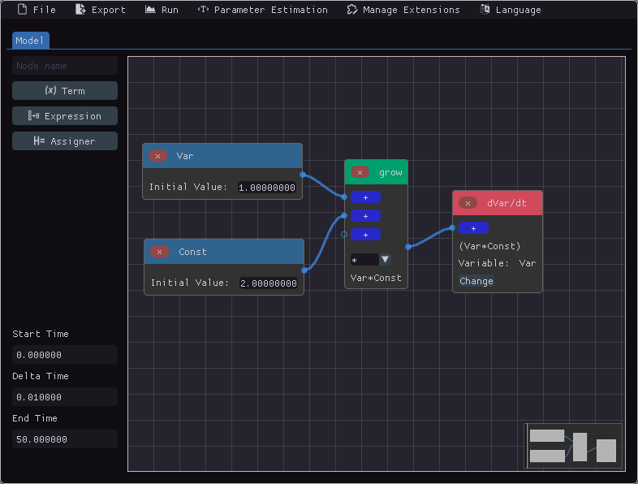
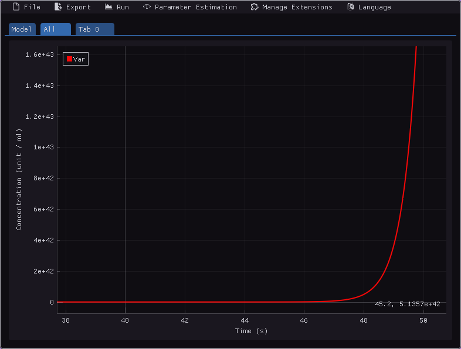
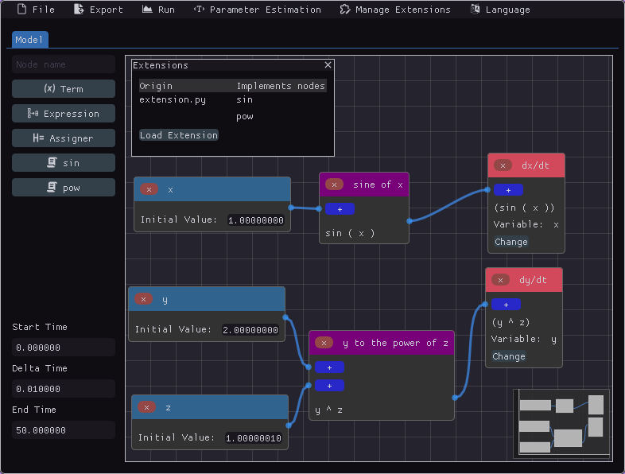
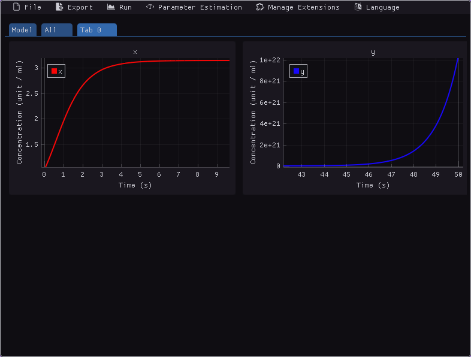

# ODE-Designer

## Introduction

Below are the description of the software, how to install it, and a brief introduction on how to use it.

## About the software

The names of the software developers are in the CONTRIBUTORS file.

ODE-Designer was developed in the context of a FAPEMIG research project by postgraduate students and undergraduate students in Computer Science at the Federal University of São João Del-Rei ([UFSJ](https: //ufsj.edu.br)).

The main objective of ODE-Designer is to facilitate the creation, implementation and simulation of Ordinary Differential Equation (ODE) models. The software can be applied to research and teaching-learning of Computational Modeling.

Through a visually intuitive graphical user interface (GUI), ODE-Designer allows users to conceptualize and ``draw'' mathematical models, while the software automatically generates the requisite implementation, simulation, and result visualization code. A distinguished feature of the software is the model's visual representation. It is designed to be intuitive and easy to use.

## Current functionalities

### Node-based editor



### Plotting



### Python code export and pdf export

```py
# imports of scipy and numpy omitted

def initial_values() -> np.ndarray:
    Var_0 = 1.0
    return np.array((Var_0,))


def constants() -> list:
    Const = 2.0
    return [Const]


def variable_names() -> list[str]:
    return ["Var"]


def system(t: np.float64, y: np.ndarray, *constants) -> np.ndarray:
    Var, = y
    Const, = constants
    
    dVar_dt = Var*Const 

    return np.array([dVar_dt])

# Rest of the code used to simulate and plot to PDF omitted
```

### Extensibility via Python code

Given the following Python code:

```py
import math

@node
def sine(x):
    return math.sin(x)


@node(format="$1 ^ $2")
def power(x, y):
    return x ** y
```

By importing it in the *Manage Extensions* menu, you can use the defined nodes as if they were native, as in the image below.



The code can be used to simulate just like native nodes.



## How to install

It is recommended to use the executables available in *Releases* on GitHub. [This link](https://github.com/Syndelis/ode-designer-rs/releases/latest) can be used to always redirect to the latest version.

### Linux

The Linux distribution uses [AppImages](https://appimage.org/), which requires a runtime (`fuse2`) installable on all Linux-based distributions. It is commonly included by default by some distributions, or is already installed by another program.

<details>
<summary><b>🐧 Para Debian/Ubuntu/Pop_OS!/ElementaryOS</b></summary>

```sh
$ sudo apt install libfuse2
```

</details>

<details>
<summary><b>🐧 Para ArchLinux</b></summary>

```sh
$ sudo pacman -S fuse2
```

</details>

### Windows

The Windows distribution consists of a ZIP that can be extracted and its contents executed.

## Compilation

### Using Docker

To compile and use the software and its full potential, you can use the provided Docker image. The dependencies are only `docker` itself and the `docker-buildx` plugin.

```sh
$ docker buildx build -t ode-designer-appimage-builder .
$ docker run -v ./container-target:/ode-designer/target/ ode-designer-appimage-builder
```

After this execution, the AppImage should be available in `.container-target/appimage/ode-designer-rs.AppImage`. This AppImage, as well as those found in *Releases*, have Python and the `scipy` and `matplotlib` dependencies for code generation, interactive simulation and PDF export.

### Manually

To compile and run the software outside of the AppImage, the Rust toolchain (nightly version) is required, as well as Python >= 3.11, and the dependencies listed in `requirements.txt`. Fulfilling these requirements, simply compile like any Rust project, running

```sh
$ cargo run
```

Or 

```sh
$ cargo build --release
$ ./target/release/ode-designer-rs
```

If anything goes wrong, try 

```sh
$ git submodule update --init --recursive
$ git submodule update --recursive --remote
```

Then, recompile and run. 
